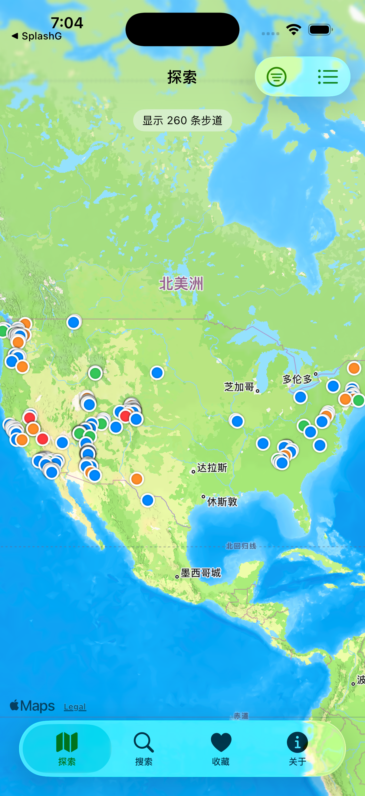

# MyTrails

一个复刻 AllTrails 的 iOS App（SwiftUI，iOS 17+），支持在 App 内直接下载全量步道数据。



## 功能

- **远端数据库 + 首启下载**：全量数据库（77,591 条美国步道 + FTS5 索引 + 42,290 条全精度离线路线，509 MB）托管在 [lfkdsk/Trails-DB](https://github.com/lfkdsk/Trails-DB/releases) 的 Release 上，App 本体仅 ~1 MB；首次启动自动下载（带进度条），「关于 → 重新下载」可随时刷新。数据库由 `scripts/build_db.py`（元数据）+ `scripts/build_routes.sh`（路线）预构建，调试可用 `MT_DB_URL` 环境变量指向本地服务器。
- **探索**：地图浏览当前区域步道（按热度取前 260 条），标记颜色对应难度；点击查看详情。
- **搜索**：FTS5 全文搜索步道名 / 公园 / 州名（CJK 输入自动退化为 LIKE），支持筛选（难度、最低评分、长度、州）。
- **详情页**：封面图、评分与评论数、距离/爬升/最高点/预计时长（公制换算）、小地图、一键开始 GPS 记录。
- **GPS 轨迹记录**：CoreLocation 实时定位，地图上实时绘制轨迹线，统计里程/用时/轨迹点；从步道详情页进入自动关联步道，也可在「记录」Tab 自由记录。**开始录制前**即画出路线（见下），**支持后台持续记录**（`UIBackgroundModes=location`，切后台不中断）。带 GPS 跳变过滤（>15 m/s 或 >500 m 的瞬移不计里程，起步阶段跳变自动重置轨迹）。结束后保存轨迹（降采样至 ≤600 点控制同步体积），可**打 1–5 星评分并写测评**。记录详情页回看完整路线图（起终点标记）、评分与测评；步道详情页显示已走次数与我的评分。「记录」Tab 汇总统计（次数/总公里/总时长），支持滑动删除。
- **每条步道的离线路线**：数据集本身只有起点坐标，无轨迹线；AllTrails 官方轨迹在 Cloudflare 与已失效的 Algolia key 之后无法合法批量获取。路线在**构建期离线预匹配**：`scripts/build_routes.sh` 逐州下载 Geofabrik 的 OSM 数据，`scripts/match_routes.py` 抽取有名字的徒步路径（`highway=path/footway/track/steps`），按步道长度自适应半径（2.5–12km）做名称分词匹配（如 "Vernal and Nevada Falls **via Mist Trail**" ↔ OSM "**Mist Trail**"），在真实路网图上用 Dijkstra 补齐换名的接驳段，以**全精度**（OSM 原始几何、6 位小数坐标）写入 `trail_routes` 表。
- **路线置信分级**：数据集只有起点坐标，OSM 匹配质量参差，因此每条路线按「长度完整度 + 同名步道占比 + 官方/实地来源标签（`operator`/`ref`/`sac_scale`）+ 通行权（剔除 `access=private`、`informal=yes`）」定级为 high/medium/low，写入 `confidence` 列。App 里 **high 显示为实线（可放心跟随）、medium 为虚线参考、low 视为"暂无收录路线"**——宁可不显示也不误导。全量 77,591 条中约 15.9k 高可信 / 7.4k 参考。**运行时不联网**，详情页小地图与录制页直接读库绘制橙色路线，录制页相机自动适配整条路线；OSM 未覆盖的步道提示「暂无收录路线」。
- **收藏**：收藏列表。
- **iCloud 同步**：收藏与徒步记录通过 iCloud 键值存储（`NSUbiquitousKeyValueStore`）跨设备同步——记录按 id 合并、`updatedAt` 新者胜、删除以墓碑传播；收藏整集合按时间戳新者胜。未登录 iCloud 时静默降级为纯本地。
- **关于**：数据统计、重新下载全量数据。

## 技术

- SwiftUI + MapKit（iOS 17 Map API），无第三方依赖
- 原生 SQLite3 C API + FTS5 全文索引；WAL 模式、批量事务导入（77k 行秒级完成）
- 自研 RFC 4180 流式 CSV 解析器（处理引号内逗号/换行/转义引号）
- [xcodegen](https://github.com/yonaskolb/XcodeGen) 生成工程

## 构建运行

```bash
brew install xcodegen
xcodegen generate
open MyTrails.xcodeproj   # 选择模拟器直接 Run
```

或命令行：

```bash
xcodebuild -project MyTrails.xcodeproj -scheme MyTrails \
  -destination 'platform=iOS Simulator,name=iPhone 17 Pro' build
```

## 调试钩子

- `MT_TAB=<0-4>`：启动时定位到指定 Tab
- `MT_DETAIL=<关键词>`：启动后直接打开首个搜索结果的详情页
- `MT_LOG_HIKE=<关键词>`：启动时自动为首个搜索结果创建一条徒步记录
- `MT_AUTO_RECORD=<秒数>`：自动打开录制界面开始 GPS 记录，N 秒后结束并保存（配合 `xcrun simctl location` 模拟移动）
- `MT_OPEN_LAST_HIKE=1`：启动时自动打开最近一条记录的详情（路线图）

## 数据说明

数据为 AllTrails 公开页面的抓取快照，版权归 AllTrails 及其贡献者所有，**仅供学习研究使用，请勿商用**。数据不含完整轨迹线，只有步道元数据与起点坐标。
